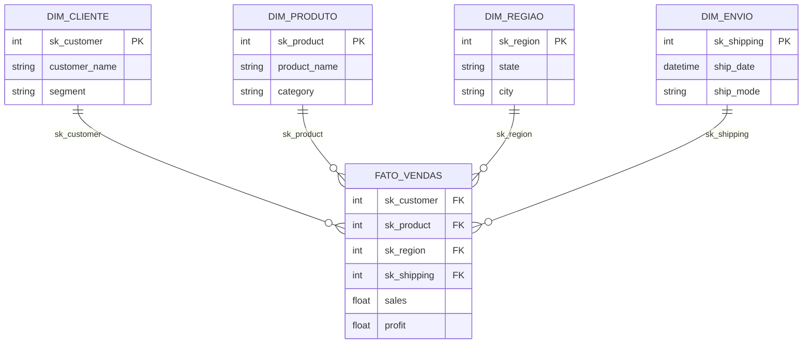

# 🚀 Star Schema com SuperStore: Arquitetura e Modelagem Dimensional de Dados

**⚠️ NOTA DE ORIGEM DOS DADOS:
Nota Importante:** O dataset original utilizado neste projeto foi extraído do site "Kaggle" e pode ser acessado através deste link: 
https://www.kaggle.com/datasets/vivek468/superstore-dataset-final

Qualquer semelhança com nomes, pessoas ou dados da vida real é mera coincidência. Este ambiente foi construído estritamente para fins de demonstração técnica e estudo de engenharia de dados.

## Sobre o Projeto

Este projeto demonstra a construção de uma arquitetura de dados analítica ponta a ponta. O objetivo foi transformar dados brutos transacionais (fictícios de uma rede SuperStore) em um modelo dimensional Star Schema (Fato e Dimensões).

A modelagem dimensional é o padrão-ouro para Business Intelligence (BI) e Data Warehousing, pois otimiza a performance de queries analíticas e facilita a leitura das ferramentas de BI.

**Diferencial Técnico:**

Este projeto foca na automação de criação de Surrogate Keys (sk_) e na validação de integridade referencial via código (verificando se toda venda tem um cliente, produto, etc. válidos), garantindo a confiabilidade do pipeline.

---

## Arquitetura e Diagrama do Modelo (Star Schema)
A estrutura abaixo ilustra como os dados brutos foram fragmentados e reorganizados para otimização analítica. A Tabela Fato centraliza as métricas e se conecta às tabelas de Dimensão através das Surrogate Keys (sk_).

*Relacionamentos criados no Power BI entre a tabela fato e as dimensões.*

---

## Resultados e Estatísticas
| Nome da Tabela | Tipo | Registros | Principais Colunas |
| :--- | :--- | :--- | :--- |
| `fato_vendas.csv` | **Fato** | 9.000 | `sk_customer`, `sales` |
| `dim_cliente.csv` | **Dimensão** | 800 | `sk_customer`, `name` |
| `dim_produto.csv` | **Dimensão** | 1.800 | `sk_product`, `name` |
| `dim_regiao.csv` | **Dimensão** | 600 | `sk_region`, `city` |

---

## Detalhes da Implementação Técnica 
O script de transformação foi desenvolvido em **Python** e demonstra práticas **avançadas de manipulação de dados:**

Limpeza e Tratamento Crítico: Uso de pd.to_datetime e pd.to_numeric(errors='coerce') para garantir que campos numéricos e de data sejam tratados corretamente, **evitando falhas de processamento em BI. Remoção de duplicatas focada na granularidade correta (Order ID + Product ID).**

Geração Automática de Surrogate Keys: Uso de range(1, 1 + len(dim_table)) **para criar chaves inteiras únicas, independentes das chaves naturais do negócio.**

Validação de Integridade via Código: Uso de declarações assert para verificar se há valores nulos (isna().sum() == 0) nas Surrogate Keys após os merges (joins). Isso previne a criação de tabelas fato "órfãs".

Exemplo:

**assert fact_sales['sk_customer'].isna().sum() == 0, "❌ Erro: Customer ID sem correspondência!"**

Otimização para **Power BI** (Localização): A exportação final utiliza decimal=',' para garantir que o **Power BI** (configurado em Português) reconheça os valores monetários corretamente sem necessidade de transformações adicionais.

## Tecnologias Utilizadas
**Python 3.9**

**Pandas (Motor de ETL)**

**PyODBC (Conexão e ingestão de dados do SQL Server)**

**Mermaid.js (Visualização do Diagrama da Arquitetura)**

## Autor
Guilherme Coradini

